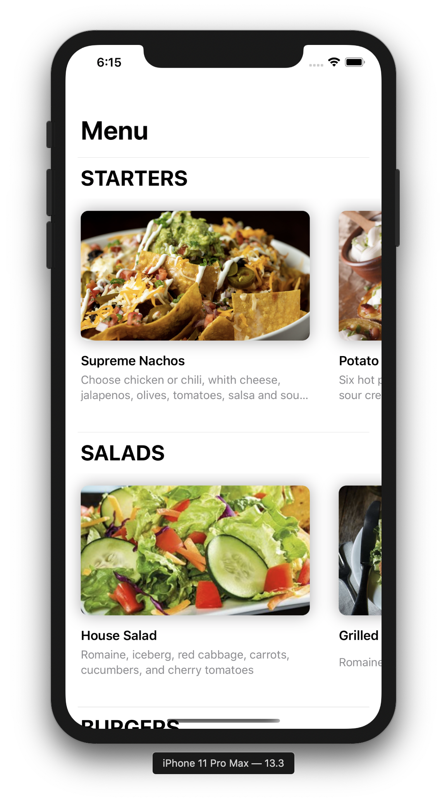
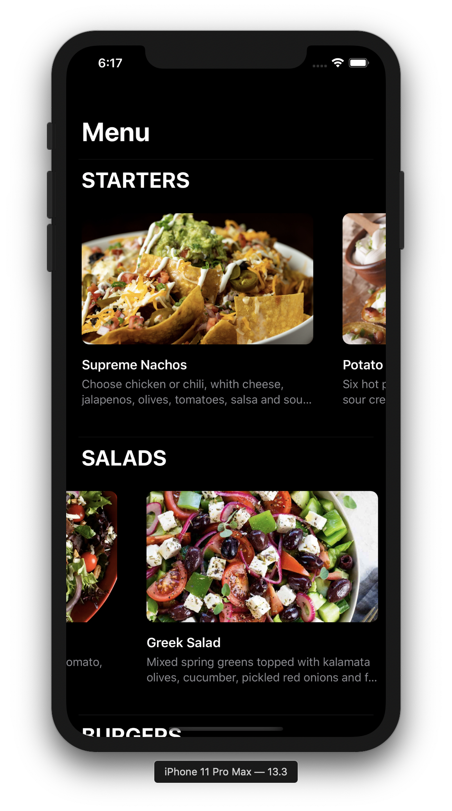
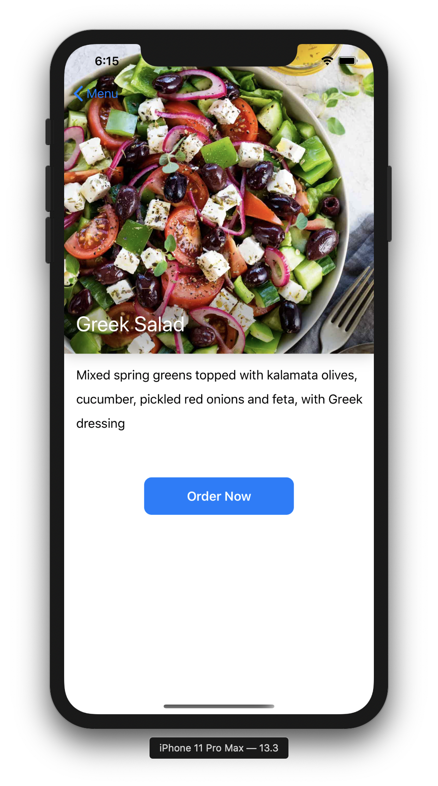
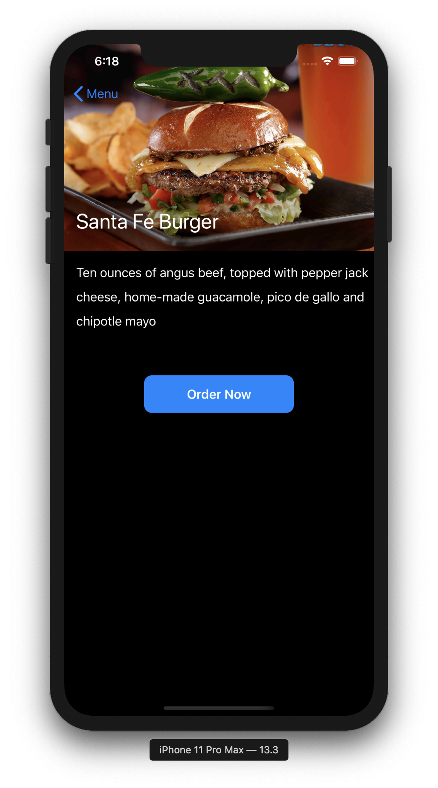
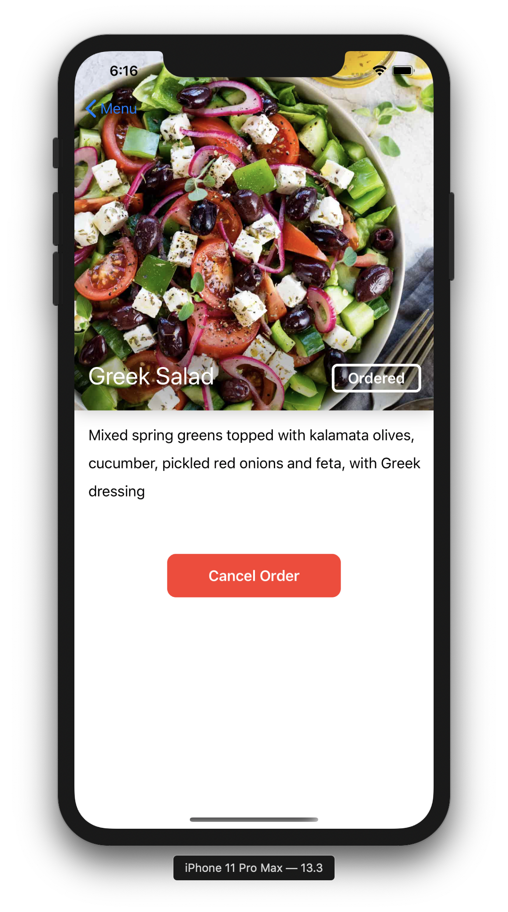
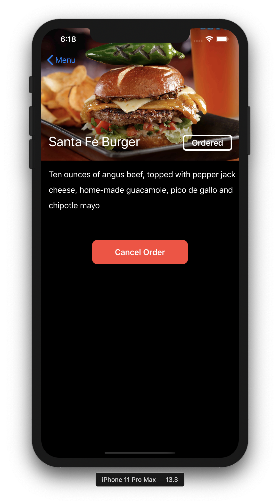

# FoodMenu
An experimental SwiftUI application for iOS to show a restaurant's menu

## Screenshots - Light and Dark Mode

Home page representing the whole menu. 

Item detail view with a button to order the item. 

Item detail view with a button to cancel the item (if ordered). 

